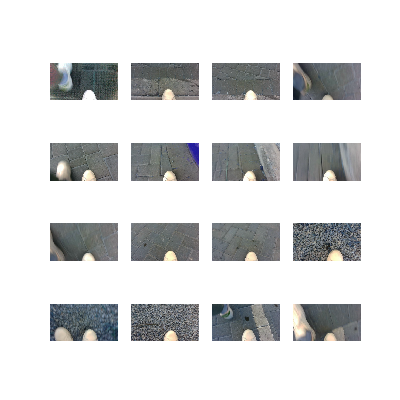
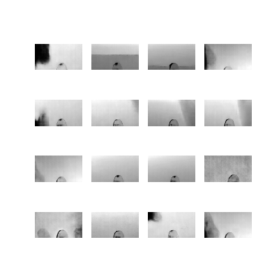
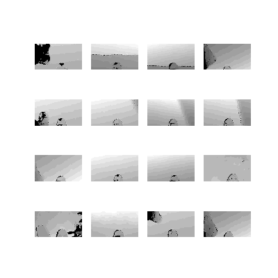

# Depth_prediction_network
This is the repository for a skip-connection and autoencoder based depth-prediction network. 
This work is in contribution to RA-L paper submitted to ICRA 2021 with Interactive Lab at ASU.

About the network structure:

The depth prediction network is built upon an dense autoencoder with skip connection from encoder to decoder.
The bottlenect has size 64
The building blocks include regular conv layers (with kernel 3x3 and 1x1), conv_blocks and identity_blocks (from Resnet).
Loss function: MSE + gradient + Total variance (TV)

Input: 180x320 RGB images
Output: 180x320 depth images

Sample Results (Input; Output; Ground Truth):

<!--  
 
 -->
